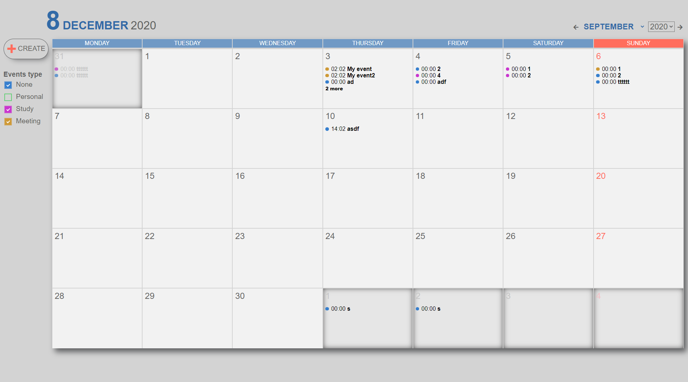

[![LinkedIn][linkedin-shield]][linkedin-url]


<!-- PROJECT LOGO -->
<br />
<p align="center">


  <h1 align="center">Monthly calendar</h1>
  <a href='https://tonijorda.com/myProjects/vanillaJS/calendar/'>View Demo</a>

</p>


<!-- ABOUT THE PROJECT -->
## About The Project
A calendar where to add events and identify them by category.




### Built With

The implementation has been done in JS vanilla, css and html. All the events are stored in the local storage.


<!-- GETTING STARTED -->
###  Getting Started


1. Clone the repo
   ```sh
   git clone https://github.com/Skebard/Monthly-Calendar.git
   ```
2. Open the index.html in your browser
3. You will be asked to load some default data the first time you enter the application. To get asked again clear the local storage.


<!-- CONTRIBUTING -->
### Contributing

Contributions are what make the open source community such an amazing place to be learn, inspire, and create. Any contributions you make are **greatly appreciated**.

1. Fork the Project
2. Create your Feature Branch (`git checkout -b feature/AmazingFeature`)
3. Commit your Changes (`git commit -m 'Add some AmazingFeature'`)
4. Push to the Branch (`git push origin feature/AmazingFeature`)
5. Open a Pull Request


[linkedin-shield]: https://img.shields.io/badge/-LinkedIn-black.svg?style=for-the-badge&logo=linkedin&colorB=555
[linkedin-url]: http://www.linkedin.com/in/tjorda
